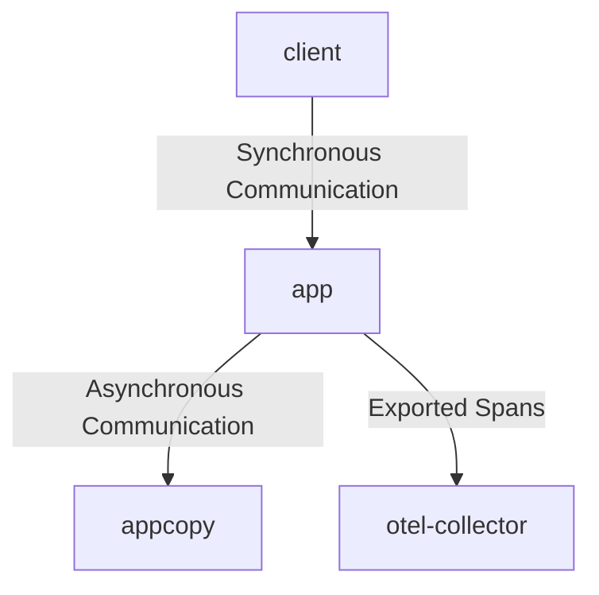

# OTel Grpc Context Cancellation Reproducing Project

A project for reproducing the error in [open-telemetry/opentelemetry-java-instrumentation/issues/4169](https://github.com/open-telemetry/opentelemetry-java-instrumentation/issues/4169)

## Projects
- `client` is a simple grpc client application that makes a request to `app`
- `app` is a grpc server instrumented with the OpenTelemetry Java Agent that makes a request to `appcopy`
- `appcopy` is a grpc server (not instrumented with the OpenTelemetry Java Agent) that makes no outbound request


## Instructions

On a machine with a docker daemon accessible, run the following commands:
```shell
$ ./gradlew jibDockerBuild
$ docker-compose up -d
```

This starts up 4 docker containers with the following communication structure: 



An error message can then be seen by viewing the logs of the instrumented `app` container

```shell
$ docker logs -f otel-grpc-context-app-1
[otel.javaagent 2022-03-01 23:06:12:697 +0000] [main] INFO io.opentelemetry.javaagent.tooling.VersionLogger - opentelemetry-javaagent - version: 1.11.1
server started on port 8080
Exception in thread "pool-3-thread-1" io.grpc.StatusRuntimeException: CANCELLED: io.grpc.Context was cancelled without error
	at io.grpc.stub.ClientCalls.toStatusRuntimeException(ClientCalls.java:262)
	at io.grpc.stub.ClientCalls.getUnchecked(ClientCalls.java:243)
	at io.grpc.stub.ClientCalls.blockingUnaryCall(ClientCalls.java:156)
	at org.hypertrace.copy.example.GreeterCopyGrpc$GreeterCopyBlockingStub.sayHelloCopy(GreeterCopyGrpc.java:210)
	at com.ryandens.otel.grpc.App$1.lambda$receiveGreeting$0(App.java:57)
	at java.base/java.util.concurrent.ThreadPoolExecutor.runWorker(Unknown Source)
	at java.base/java.util.concurrent.ThreadPoolExecutor$Worker.run(Unknown Source)
	at java.base/java.lang.Thread.run(Unknown Source)
```

